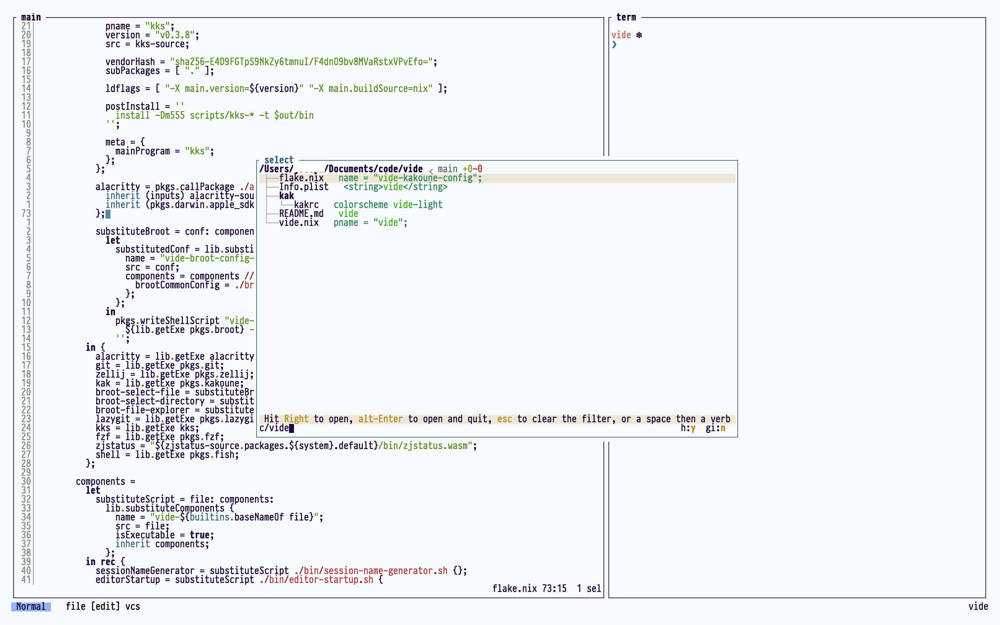

<h1> 
  vide
</h1>

A nix-powered IDE assembled from individual components, namely:
- [kakoune](https://kakoune.org/) (editor)
- [kks](https://github.com/kkga/kks) (kakoune interop tool)
- [lazygit](https://github.com/jesseduffield/lazygit) (git client)
- [zellij](https://zellij.dev/) (terminal multiplexer)
- [zjstatus](https://github.com/dj95/zjstatus) (zellij status bar)
- [alacritty](https://alacritty.org) (terminal emulator)
- [fish](https://fishshell.com/) (shell)
- [broot](https://dystroy.org/broot/) (file explorer/picker)
- [fzf](https://github.com/junegunn/fzf) (picker for everything else)



## Motivation

Thanks to Nix flakes, one can directly invoke `nix run github:felko/vide` from any computer with Nix installed with flake and nix-command experimental features.
The IDE will run and leave no trace after garbage collection.
The configuration is completely standalone which means you will get the exact same interface regardless of any potential XDG configurations.

## Make your own

The choice of tools and config is very opinionated and is not written in a modular way.
Feel free to fork the repo if you want to use different tools or anything that makes it more to your liking.
That being said, I won't accept PRs that add support for alternative tools (e.g. other editors, file explorers, etc) since this repo is intended for my personal use.

## Installation

While the primary purpose is to be able to run the IDE by URL as shown above, it's also possible to

### NixOS/nix-darwin

```nix
{
  inputs = {
    ...

    vide.url = "github:felko/vide";
  };

  outputs = inputs @ { self, ... }: {
    # darwinConfigurations.myconfig = nix-darwin.lib.darwinSystem rec {
    #   system = "aarch64-darwin";
    # or
    nixosConfigurations.myconfig = nixos.lib.nixosSystem rec {
      system = "x86_64-linux";
      modules = [ ./configuration.nix ];
      specialArgs = {
        inherit inputs;
      };
    };
  };
}
```

```nix
{ pkgs, inputs, system, ... }:

{
  environment.systemPackages = [
    inputs.vide.packages.${system}.vide
  ];
}
```

### Home-manager


```nix
{
  inputs = {
    ...

    vide.url = "github:felko/vide";
  };

  outputs = { nixpkgs, ... } @ inputs:
    let
      system = "aarch64-darwin";
      pkgs = nixpkgs.legacyPackages.${system};
    in {
      homeConfigurations.joseph = home-manager.lib.homeManagerConfiguration {
        ...
        extraSpecialArgs = {
          inherit inputs system;
        };
      };
    };
}
```

```nix
{ pkgs, inputs, system, ... }:

{
  home.packages = [
    inputs.vide.packages.${system}.vide
  ];
}
```

### Profile installation

```nix
nix profile install github:felko/vide
```

